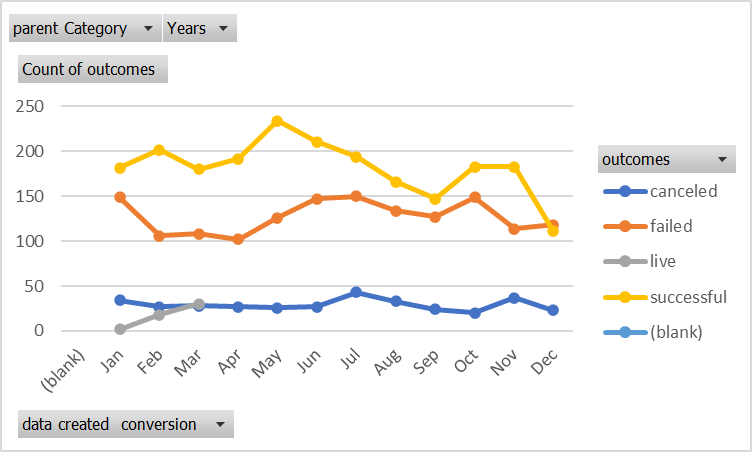

# An Analysis of Kickstarter Campaigns.
This project uses Excel to organize, sort and analyzes Kickstarter crowd funding data to determine specific factors for project success. For the analysis we created the visualizations below.

## Visualizations 

 We can see by looking at our new chart that the months of May and June both have a greater success rate.

